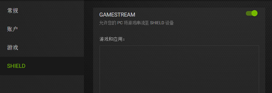
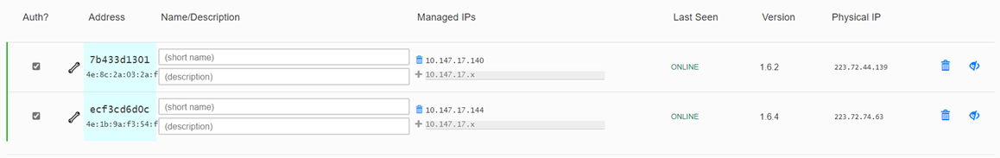
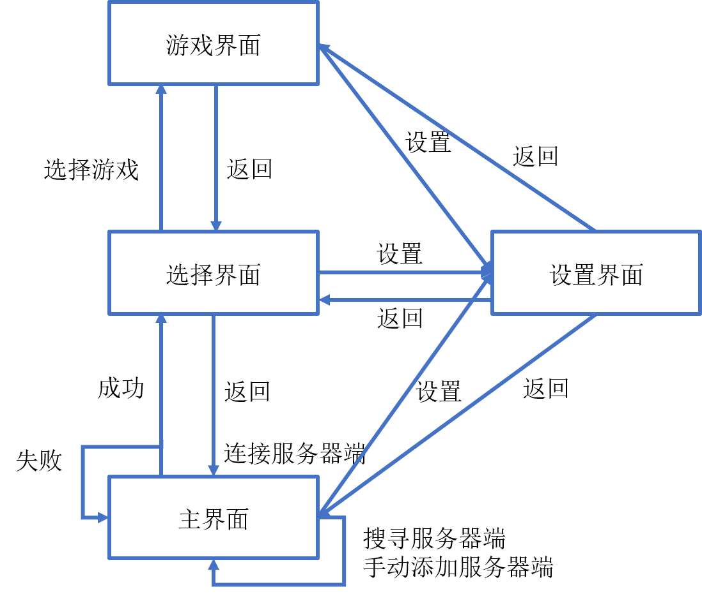
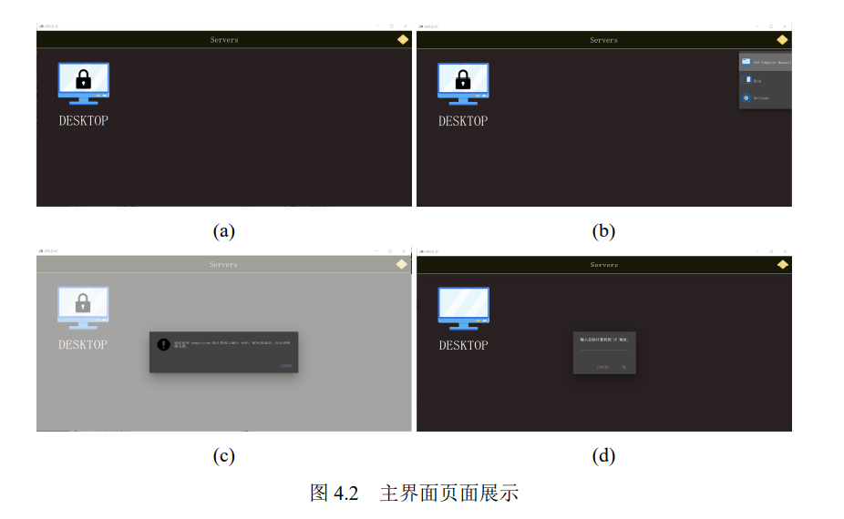
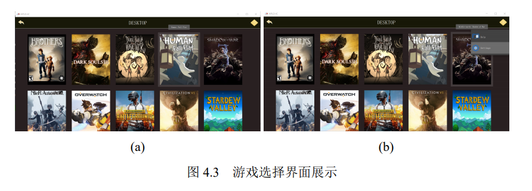
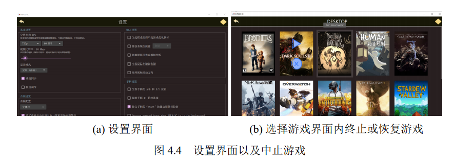

# HPLD-IC系统代码和使用手册

本系统时基于开源项目moonlight的一个云游戏框架。

## 使用手册

### 运行环境和运行条件

demo可执行文件在demo文件夹中，这是一个打包封装好的绿色便携版软件，运行该部分只需要1、2部分。

运行demo只需1、2部分，若使用虚拟局域网需要再补上3部分，若希望自己在Qtcreator等平台上进行代码运行和调试则需要4部分，若需要再次打包则需要5部分。

1. 实验配置要求：服务器端和用户终端均为64位windows操作系统。

2. 服务器端额外需要的配置：

   - nvidia geforce experience（安装后需要打开设置中shield的gamestream选项）
   - Moonlight Internet Hosting Tool(安装包在installer文件夹中)

   

3. 虚拟局域网连接方法：

   安装installer文件夹中的zerotier one安装包，打开程序后在托盘区中右键设置，通过在网站中注册虚拟局域网后，将服务器端和用户终端都作为节点加入到虚拟局域网中。

   

4. 服务器端和用户终端运行条件：

   - Qt 5.15 SDK及以上以及相应构建套件为**MSVC 2019**（实验使用的为Desktop Qt 6.03 MSVC 2019 64 bit）
   - Visual Studio 2019

5. 再次运行和打包可执行文件：

   运行代码可以通过Qt Creator对项目进行构建和运行，若打包则需要用到下面两个工具：

   - [7-Zip](https://www.7-zip.org/)
   - [WiX Toolset](https://wixtoolset.org/releases/)

   打包时需要将上面两个加入到系统环境变量中，然后在moonlight-qt文件夹中使用`scripts\build-arch.bat release x64`即可构建x64的程序。

### 使用过程

系统界面逻辑如下：

在**服务器云端和用户终端**都打开应用程序（或者在Qt creator中打开运行调试)后，进入主界面。

**服务器云端**唯一需要操作的就是在用户终端尝试连接时**输入验证码**，其余操作均在用户终端完成。

用户终端操作时，分为**主界面、选择界面、设置界面和游戏界面**。

**主界面：**在客户端打开后的主界面如图4.2(a)所示，点击右上角的菜单按钮可以打开 菜单，如图4.2(b)菜单中功能为手动添加电脑、帮助和串流配置设置。上锁图标表 示在局域网中搜索到但是未进行匹配的电脑，点击电脑后进入验证码验证环节， 如图4.2(c)，输入验证码后锁会解锁，此时再点击电脑则进入游戏选择界面，如 图4.2(d)，同时可以通过 IP 手动添加电脑。

**选择界面：**主界面点击电脑图标后就进入游戏选择界面，如图4.3(a), 此时点击游戏图标 就进入游戏界面，点击右上角菜单按钮同样会跳出菜单，如图4.3(b), 在菜单里可 以选择进入设置界面。此外点击左上角的返回按钮则返回主界面，可以到主界面 选择别的服务器端。

**设置界面：**设置界面就是进行相关串流配置设置的界面，包括选择分辨率、视频比特率、 视频编解码器类型等一些列设置选项，其界面如图4.4(a)。

**游戏界面：**游戏界面即为进行游戏时的界面。在游戏界面可以选择返回到游戏选择界面，此时若保持服务器云端的游戏不停止，则可以随时选择再次恢复到游戏中，如图4.4(b)。其中游戏时主要用到的快捷键如下：

- Ctrl+Alt+Shift+Q-退出流媒体会话（让游戏在主机上运行）
- Ctrl+Alt+Shift+Z-切换鼠标和键盘捕捉
- Ctrl+Alt+Shift+S-打开性能统计叠加
- Ctrl+Alt+Shift+M-切换鼠标模式（指针捕捉或直接控制）
- Ctrl+Alt+Shift+V-在主机上输入剪贴板文本

## 代码简介

项目文件夹分为demo文件夹、installer文件夹，Qt Creator的debug和release编译文件夹，readme.pic的readme图片文件夹以及moonlight-qt文件夹。

其中demo文件中中为打包之后的绿色便携版程序，解压后在文件夹中使用前面的使用方法即可运行。installer文件夹中为安装过程中用到的一些软件的压缩包。moonlight-qt文件夹中为基于moonlight的云游戏框架代码。

moonlight-qt文件夹中主要代码在app文件夹中，该文件夹中包括了后端、客户端、界面、设置、串流在内的一系列代码，同时该文件夹下的resource文件夹中包含了图形界面的一系列qml文件。此外moonlight-common-c作为从moonlight移植而来的核心代码，包括了串流、网络连接等一系列的核心内容。最后是soundio和h264bitstream等一系列相关音频视频具体算法文件夹。

